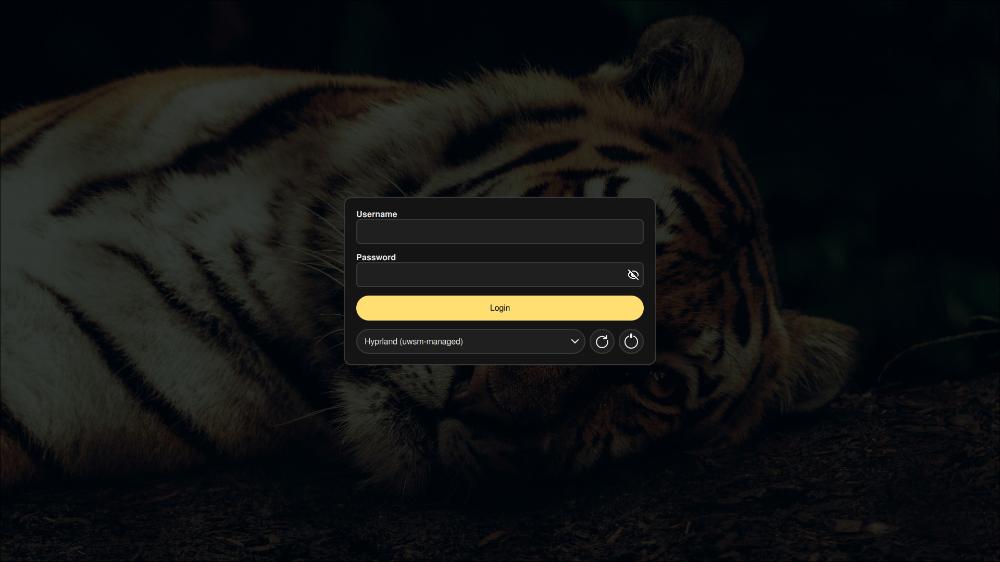
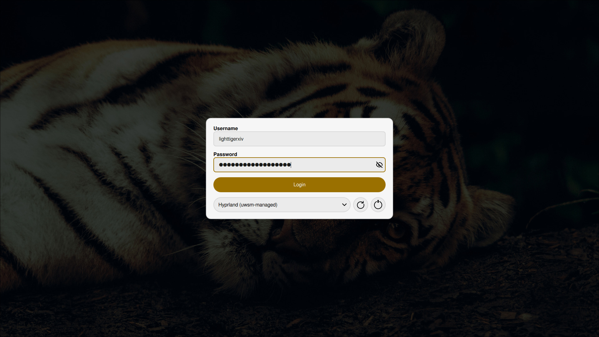

<div align="center">

  

  # Mono Code for SDDM

  <div>
      
      
  </div>
  <div>
      
      
  </div>
</div>

# Install
To install a theme run the interactive install script.

```bash
# Clone Repository
git clone https://github.com/Mono-Code-Scheme/sddm

# Run the install script
cd sddm
python install.py
```

If you skip the step to manually change the sddm.conf you can go to `/etc/sddm.conf` and add/change the config file.
```conf
[Theme]
Current=monocode
```

# Usage
You can use the following parameters in the install script. If nothing is provided it will install panther yellow by default.

|Parameter|Values|Description|
|--|--|--|
|--scheme|[panther, lynx]|Select the base color scheme|
|--accent|[red, orange, yellow, green, neon-green, cyan, blue, purple, pink]|Select the accent color|
|--wallpaper|*path_to_wallpaper*|Select the wallpaper|

Example:
`python install.py --scheme lynx --accent blue --wallpaper ~/Pictures/wallpaper.png`

# Maintainers
🐈‍⬛ lighttigerXIV
